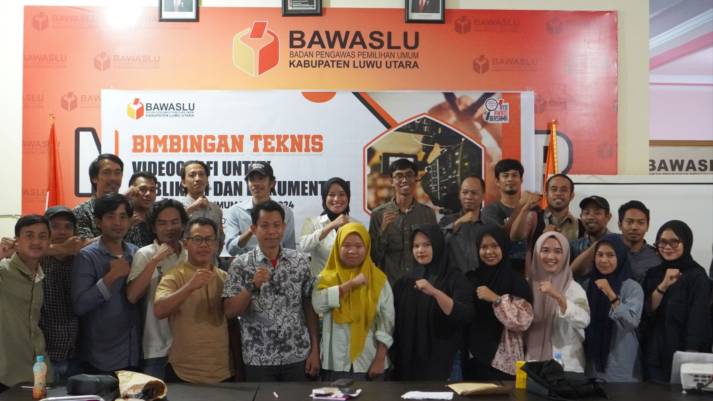
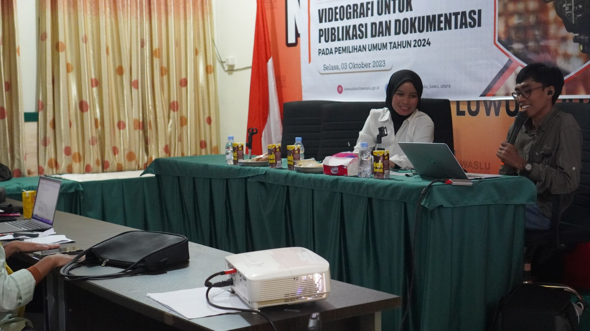
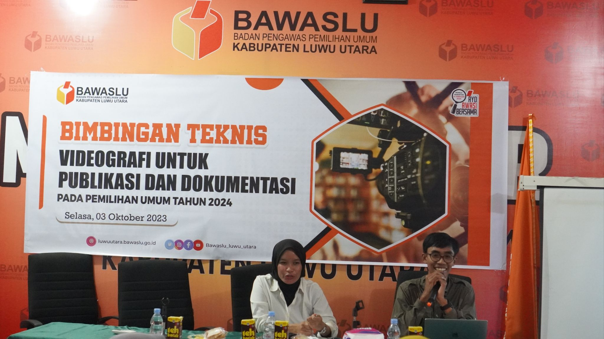
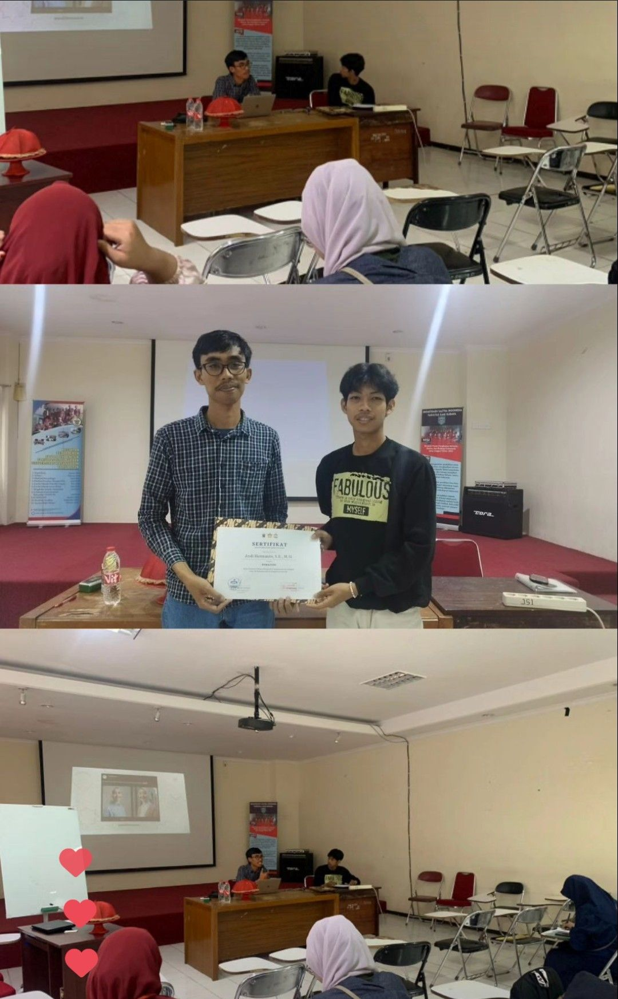

# Community service

## Pemateri Bimtek Dokumentasi dan Publikasi Bawaslu Luwu Utara

<figure><figcaption></figcaption></figure>

<figure><figcaption></figcaption></figure>

<figure><figcaption></figcaption></figure>

<figure><figcaption></figcaption></figure>

## Speaker: Writing Workshop on Linguistics Student Association of Law Studies, Alauddin State Islamic University, Makassar

<figure><figcaption></figcaption></figure>

<figure><figcaption></figcaption></figure>

## Sharing Social Media Content di Media Online&#x20;

Jumat (30/3/2023) kemarin berdiskusi bersama teman-teman mahasiswa dari sejumlah kampus di Makassar mengenai social media dan content.

Sedikit menekankan pentingnya social media di era saat ini, bahkan saya mencoba mengunggah mereka untuk bersengkongkol menggaungkan campaign perubahan.

<figure><figcaption></figcaption></figure>

## Diskusi Pasar Model

<figure><figcaption></figcaption></figure>

<figure><figcaption></figcaption></figure>

<figure><figcaption></figcaption></figure>

Workshop Data Sains dan Dashboard Data pada tanggal 15-17 September lalu

