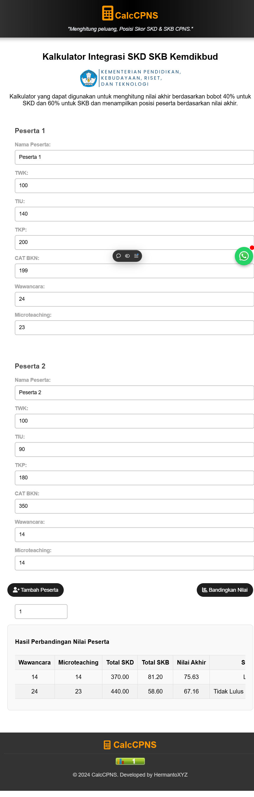
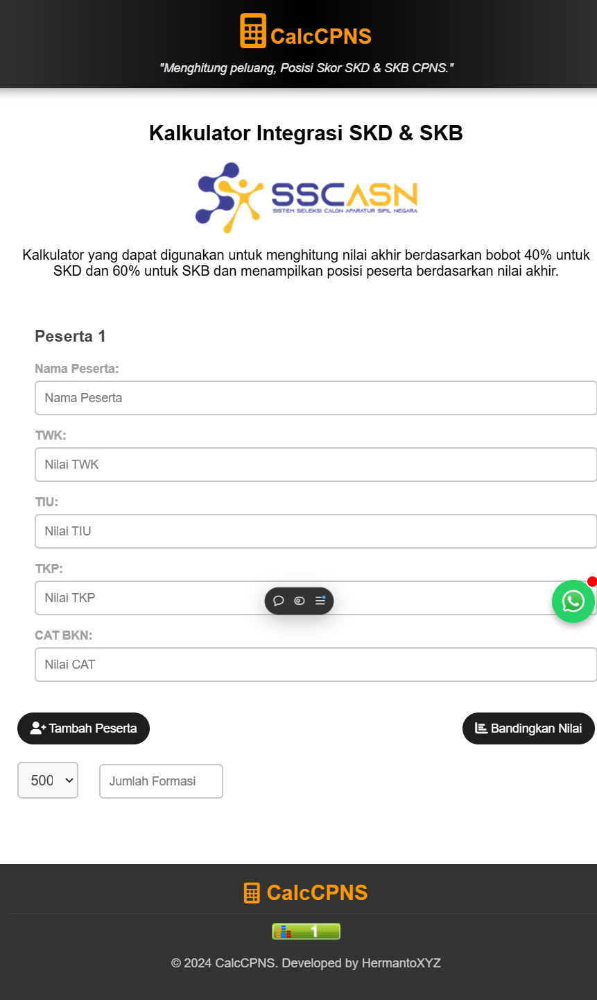

# Calc-CPNS

Berikut ini dokumentasi mengenail Calc CPNS, sebuah app untuk Menghitung peluang, Posisi Skor SKD & SKB CPNS. Tidak menggunakan Backend seperti `django` ataupun yang lain. Saya hanya menggunakan `HTML` dan `JS` .

Saat ini project atau web app yang simple tersebut telah diakses oleh ribuan pengguna, Calon ASN untuk menghitung peluang dari Seleksi Kompetensi Dasar (SKD) dan Seleksi Kompetensi Bidang (SKB).

<figure><figcaption>
Ini penampakan dari pengguna project tersebut
</figcaption></figure>

Saya menggunakan vercel `Vercel's Frontend Cloud provides the developer experience and infrastructure to build, scale, and secure a faster, more personalized web.` tentu sebagai penyedia hosting gratis, menggunakan vercel memudahkan user untuk mengakses tanpa kita harus menyewa sebuah layanan untuk project yang kita kembangkan.

Silahkan jika ingin mengakses dan menghitung skor SKD dan SKB untuk Kementrian yang kalian lamar, di bawah saya akan membagikan capture untuk menggunakannya.

## 1.1 Link Project: Calc CPNS (Kalkutor SKD danSKB)


Silahkan diklik dan kalian bisa akses dan gunakan.


## 1.2 Repository Github


Silahkan diakses dan gunakan dengan bijak ya..


## 1.3 Capture gambar project (Kemdikbud Dosen)

<figure><figcaption>
Ini adalah halaman home, ketika kalian baru mengunjungi pertama kali..
</figcaption></figure>

<figure><figcaption>
Tampak gambar untuk menambahkan peserta 1 atau peserta 2 dengan menampilkan jumlah formasinya
</figcaption></figure>

<figure><figcaption>
Hasil dari perbandingan Nilai Peserta (Hitung Nilai SKD dan SKB Kemdikbud)
</figcaption></figure>

## 1.4 Capturen Project untuk Formasi Umum

<figure><figcaption>
Untuk untuk menghitung SKB dan SKD formasi umum
</figcaption></figure>
